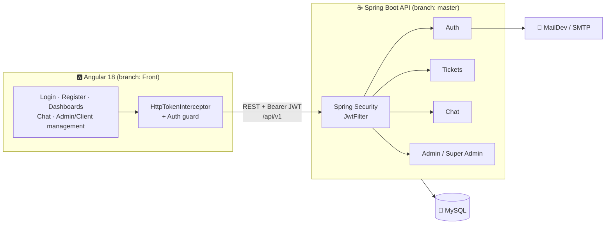
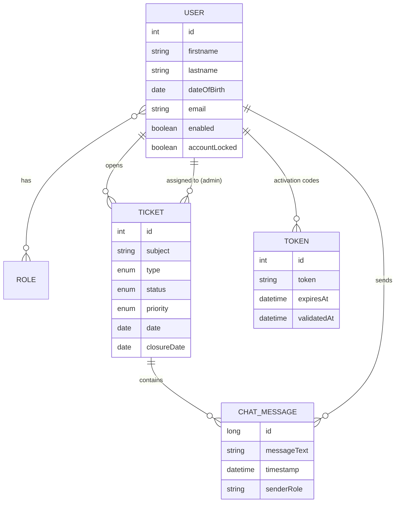

<div align="center">

# 🎫 Tickets Management — Helpdesk Platform

**A full-stack helpdesk where clients open support tickets, admins resolve them, and everyone talks in a per-ticket chat.**


</div>

---

## 📖 Table of Contents

- [Overview](#-overview)
- [Roles](#-roles)
- [Features](#-features)
- [Architecture](#-architecture)
- [Data Model](#-data-model)
- [Tech Stack](#-tech-stack)
- [Repository Layout](#-repository-layout)
- [Getting Started](#-getting-started)
- [API Reference](#-api-reference)

---

## 🌟 Overview

**Tickets Management** is a helpdesk application for handling customer support requests from start to finish:

1. A **client** signs up and activates the account by email, then opens a ticket (an incident, question, problem, or suggestion).
2. The **super admin** assigns the ticket to an **admin**.
3. The admin and the client discuss it in the ticket's **chat** until it is resolved and **closed**.

The **backend** is a Spring Boot REST API secured with JWT, and the **frontend** is an Angular 18 app.

---

## 👥 Roles

| Role | Can do |
|---|---|
| 🙋 **User (client)** | Register, activate the account, create, edit, and delete tickets, search and filter tickets, and chat on a ticket |
| 🛠️ **Admin** | See the tickets assigned to them, chat with clients, and close tickets |
| 👑 **Super Admin** | Manage admins and clients (CRUD), see all tickets, **assign tickets** to admins, view ticket statistics, and email admins |

---

## ✨ Features

| | Feature |
|---|---|
| 🔐 | **JWT authentication** with role-based authorization (`USER`, `ADMIN`, `SUPER_ADMIN`) |
| ✉️ | **Account activation by email** using a 6-digit code and an HTML template (Thymeleaf), tested locally with MailDev |
| 🎫 | **Ticket lifecycle**: `New` → `InProgress` → `Resolved` → `Closed`, with a closure date |
| 🏷️ | Ticket **type** (Incident, Suggestion, Question, Problem) and **priority** (Low, Medium, High) |
| 🔎 | **Paginated** ticket lists with search and filters (JPA Specifications) |
| 💬 | **Per-ticket chat** between the client and the assigned admin |
| 📌 | **Ticket assignment** from the super admin to an admin |
| 📊 | **Statistics**: tickets per client and tickets per admin |
| 🧾 | **Auditing**: created and last-modified timestamps on entities |
| ⚠️ | **Global exception handling** with business error codes |
| 📑 | **Swagger UI** generated with springdoc-openapi |

---

## 🏗 Architecture



---

## 🗃 Data Model



---

## 🛠 Tech Stack

| Layer | Technology |
|---|---|
| Backend | Java 17, Spring Boot 3.3 (Web, Data JPA, Security, Validation, Mail, Thymeleaf) |
| Auth | JWT (jjwt 0.11), BCrypt |
| Database | MySQL with Hibernate |
| API docs | springdoc-openapi (Swagger UI) |
| Frontend | Angular 18 (SSR-ready), Bootstrap, RxJS, an API client generated from OpenAPI |
| Dev tools | Docker Compose (MySQL and MailDev), Maven Wrapper |

---

## 📂 Repository Layout

The backend and frontend are on **separate branches**:

| Branch | Content |
|---|---|
| **`master`** | Spring Boot backend (this README) |
| **`Front`** | Angular 18 frontend |

```
src/main/java/com/example/Project
├── Admin/          # Admin & Super Admin controllers + service
├── Chat/           # Per-ticket chat (entity, service, controller)
├── Common/         # Shared types (PageResponse)
├── Config/         # Beans, auditing, OpenAPI
├── Controller/     # Authentication (register, login, activation)
├── Security/       # JWT filter & service, security config
├── Ticket/         # Ticket entity, service, mapper, specifications
├── User/           # User & activation token
├── email/          # Email service & templates
├── handler/        # Global exception handling
└── role/           # Roles
```

---

## 🚀 Getting Started

### Prerequisites

- **JDK 17+**
- **Docker** (for MySQL and MailDev), or a local MySQL instance
- **Node.js 18+** and the **Angular CLI 18** for the frontend

### 1. Start the infrastructure

```bash
git clone https://github.com/achreflajmi/Tickets-Management.git
cd Tickets-Management
docker compose -f docker-composer.yml up -d
```

| Service | URL |
|---|---|
| MySQL | `localhost:3306` |
| MailDev (inbox UI) | http://localhost:1080 |

### 2. Configure the backend

Secrets are **never stored in the repo**. They are read from environment variables:

| Variable | Required | Description |
|---|---|---|
| `JWT_SECRET_KEY` | ✅ | Base64 HMAC key of at least 256 bits, for example from `openssl rand -base64 32` |
| `MAIL_PASSWORD` | — | SMTP password. Leave it unset when using MailDev |

```bash
export JWT_SECRET_KEY=$(openssl rand -base64 32)    # PowerShell: $env:JWT_SECRET_KEY="..."
```

Other settings are in `src/main/resources/application.properties`:

| Property | Description |
|---|---|
| `spring.datasource.url` | `jdbc:mysql://localhost:3306/helpdesk` |
| `spring.datasource.username` / `password` | Database credentials |
| `spring.mail.host` / `port` | `localhost` / `1025` to use MailDev |
| `application.mailing.frontend.activation-url` | `http://localhost:4200/activate-account` |

### 3. Run the backend

```bash
./mvnw spring-boot:run        # Windows: mvnw.cmd spring-boot:run
```

- API base URL: **http://localhost:8081/api/v1**
- Swagger UI: **http://localhost:8081/api/v1/swagger-ui/index.html**

### 4. Run the frontend

```bash
git checkout Front
npm install
npm start                     # → http://localhost:4200
```

---

## 📡 API Reference

All paths are relative to **`/api/v1`**. Every route except `/auth/**` requires an `Authorization: Bearer <token>` header.

<details>
<summary><b>🔐 Authentication</b> · <code>/auth</code></summary>

| Method | Endpoint | Description |
|---|---|---|
| `POST` | `/auth/register` | Register a client (sends an activation email) |
| `POST` | `/auth/register-admin` | Register an admin |
| `POST` | `/auth/register-super-admin` | Register a super admin |
| `POST` | `/auth/authenticate` | Log in and receive a JWT |
| `GET` | `/auth/activate-account?token=` | Activate an account |
| `GET` | `/auth/USER` | Get the logged-in user's ID from the token |

</details>

<details>
<summary><b>🎫 Tickets</b> · <code>/tickets</code></summary>

| Method | Endpoint | Description |
|---|---|---|
| `POST` | `/tickets` | Create a ticket |
| `GET` | `/tickets` | All tickets (paginated) |
| `GET` | `/tickets/all` | All tickets (unpaginated) |
| `GET` | `/tickets/user` · `/tickets/by-user` | The current user's tickets (paginated) |
| `GET` | `/tickets/{id}` | Ticket details |
| `PATCH` | `/tickets/{id}` | Update a ticket |
| `POST` | `/tickets/{id}/close` | Close a ticket |
| `DELETE` | `/tickets/{id}` | Delete a ticket |

</details>

<details>
<summary><b>💬 Chat</b> · <code>/chat</code></summary>

| Method | Endpoint | Description |
|---|---|---|
| `GET` | `/chat/{ticketId}` | Messages for a ticket |
| `POST` | `/chat/send` | Send a message |

</details>

<details>
<summary><b>🛠️ Admin</b> · <code>/admin</code></summary>

| Method | Endpoint | Description |
|---|---|---|
| `GET` | `/admin/tickets/{adminId}` | Tickets assigned to an admin |

</details>

<details>
<summary><b>👑 Super Admin</b> · <code>/superAdmin</code></summary>

| Method | Endpoint | Description |
|---|---|---|
| `GET` | `/superAdmin/admins` | List admins |
| `POST` | `/superAdmin/addAdmin` | Add an admin |
| `PUT` | `/superAdmin/modify-admin/{id}` | Edit an admin |
| `DELETE` | `/superAdmin/delete-admin/{id}` | Delete an admin |
| `GET` | `/superAdmin/clients` | List clients |
| `POST` | `/superAdmin/add-client` | Add a client |
| `PUT` | `/superAdmin/modify-client/{id}` | Edit a client |
| `DELETE` | `/superAdmin/delete-client/{id}` | Delete a client |
| `GET` | `/superAdmin/tickets` | All tickets |
| `PUT` | `/superAdmin/assign-ticket/{ticketId}/admin/{adminId}` | Assign a ticket to an admin |
| `GET` | `/superAdmin/client-tickets-count` | Ticket count per client |
| `GET` | `/superAdmin/admin/{adminId}/tickets-count` | Ticket count for an admin |
| `GET` | `/superAdmin/chats/{ticketId}` | A ticket's chat |
| `POST` | `/superAdmin/send-email` | Email an admin |

</details>

---

<div align="center">

Made with ❤️ by [Achref Lajmi](https://github.com/achreflajmi)

</div>
